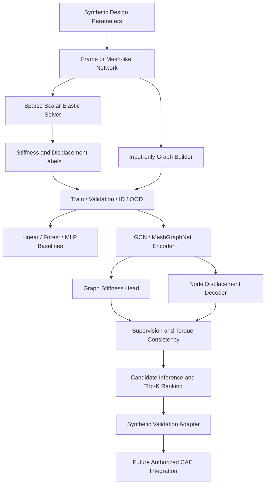

# Synthetic AI-CAE Architecture

```mermaid
flowchart TD
  A[Synthetic Design Parameters] --> B[Frame or Mesh-like Network]
  B --> C[Sparse Scalar Elastic Solver]
  C --> D[Stiffness and Displacement Labels]
  B --> E[Input-only Graph Builder]
  D --> F[Train / Validation / ID / OOD]
  E --> F
  F --> G[Linear / Forest / MLP Baselines]
  F --> H[GCN / MeshGraphNet Encoder]
  H --> I[Graph Stiffness Head]
  H --> J[Node Displacement Decoder]
  I --> K[Supervision and Torque Consistency]
  J --> K
  K --> L[Candidate Inference and Top-K Ranking]
  L --> M[Synthetic Validation Adapter]
  M --> N[Future Authorized CAE Integration]
```

The OptiStruct extension is intentionally unimplemented. No real automotive data is present.
